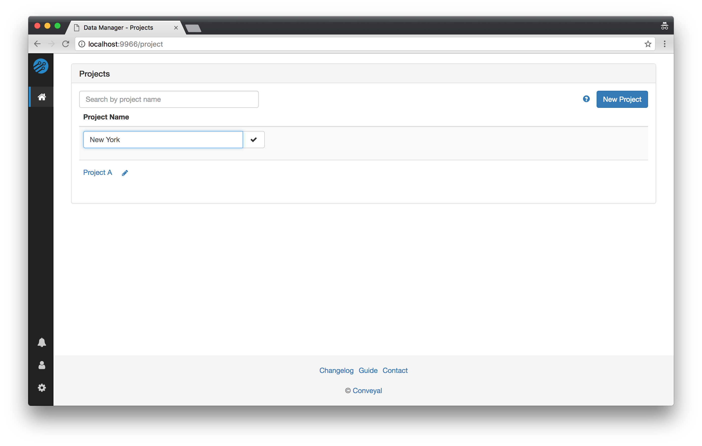
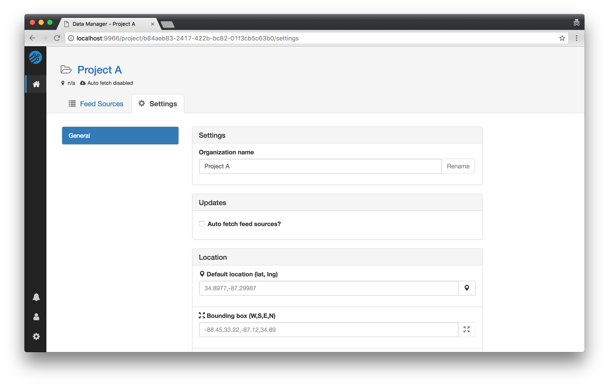
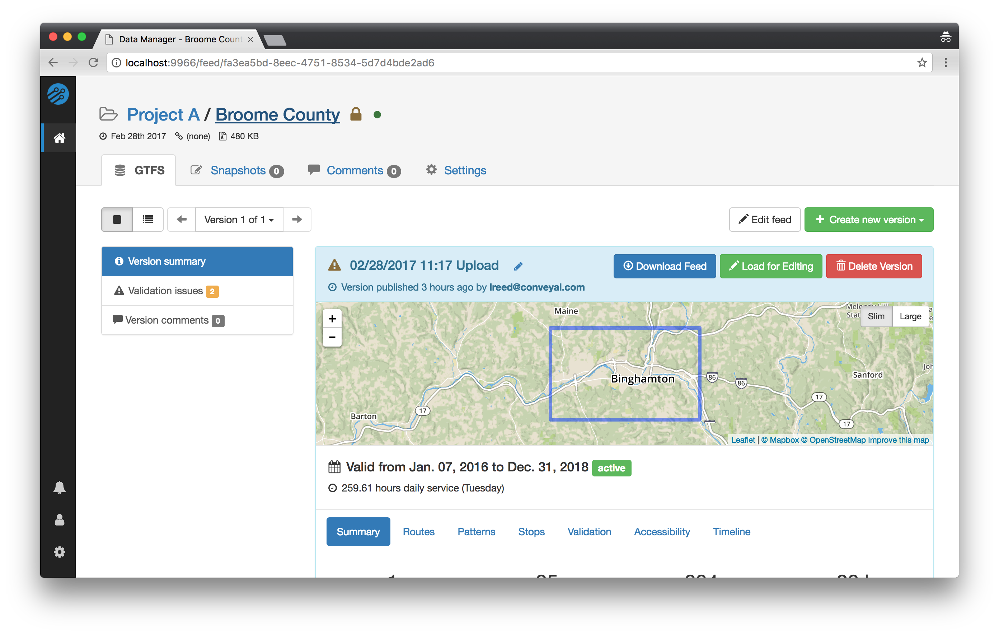

# Managing Projects and Feeds

## Creating Projects

Projects are created from the main Project listing page. Click the "New Project" button to create a new Project; a row for the new Project will appear in the table. Type a name and click the check button (or hit Enter/Return) to finish creating the Project.

## Managing Projects

Clicking on a project in the main project listing will take you to the detailed project profile page:

At the top of the page is the **Project Settings** panel which can be expanded to reveal optional properties that can be specified for the project. These include the location of the project's geographic coverage area (specified either as a single coordinate or a rectangular region), the default time zone, and default language. These values, when provided, are used to populate the corresponding feed-level properties when creating new feeds within this project.

Below the Project Settings panel is the **Feed Sources** panel. Feed Sources are the core of a project, and are documented in more detail below.

## Creating a Feed Source

Feed Sources are created from a Project's main profile page. Click the "New Feed" button to create a new feed; a row for the new Feed Source will appear in the table. Type a name and click the check button (or hit Enter/Return) to finish creating the Feed Source.

## Managing Feed Sources

After a Feed Source has been created, it will appear in the Project's table of Feed Sources. From this table, the **name** of the Feed Source can be changed, the **public visibility** of the feed can be toggled, and basic summary information for the feed is presented. Users with sufficient permissions can also **delete** a Feed Source using the "X" button to the far right of its table listing.

To access all other settings for this Feed Source, click on the its name to access the full Feed Source profile page:

At the top of the page is the **Feed Source Settings** panel, which allows editing of basic Feed Source properties such as name and public visibility, and is also used to manage the retrieval of GTFS data (covered in more detail below). Any settings provided by custom extensions are also listed in this section.

Below the Settings panel is **Comments** panel, where users can leave and view comments specific to this Feed Source, and the **Feed Version Navigator**, which is used to view individual Feed Versions and is covered in more detail below.

## Creating Feed Versions

Feed Versions are created from the main Feed Source profile page. There are three methods for creating new versions:

1. **Manually Upload a File**: Select "Manually Uploaded" from the "Retrieval Method" dropdown. The button next the the dropdown should now say "Upload." Click the "Upload" button to select a GTFS file from your local machine.

2. **Fetch From A Remote URL**: Select "Fetched Automatically" from the "Retrieval Method" dropdown. A "Retrieval URL" field should now be visible. Enter the URL of remote feed into the field and click the "Update" button to fetch the file currently available from the specified URL.

3. **Import From the GTFS Editor**: Select "Produced In-house" from the "Retrieval Method" dropdown. A "Snapshot" dropdown selector should now be visible showing any available snapshots of the feed in the GTFS Editor. Select the desired snapshot and click the "Update" button to import the feed.

Note: when uploading or fetching a feed, and the file being uploaded or fetched is not different from the latest version, no new Feed Version will be created.

## Viewing and Managing Feed Versions

The Feed Version navigator allows you to navigate through all available versions of a given feed using the "Next" and "Previous" buttons. You may also use this interface to download a Feed Version to your local machine as a GTFS data file and delete a Feed Version from the Data Manager. (Note: deleting a Feed Version cannot be undone.)

Below the navigator is information specific to the currently active version. This including basic feed statistics, the detailed feed validation report, and any user comments specific to this feed.
